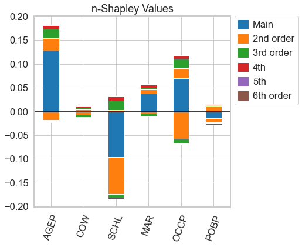
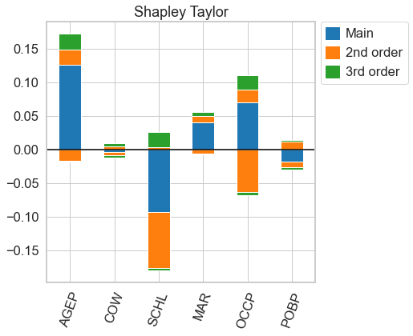
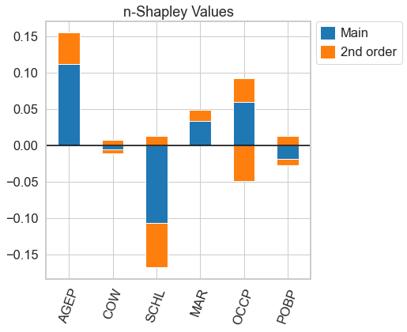
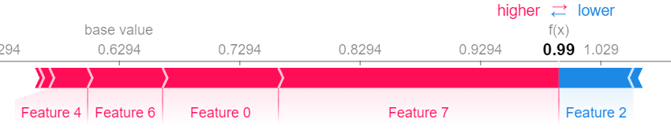

# Welcome to the nshap Package!

[](https://opensource.org/licenses/MIT)


This is a python package to compute $n$-Shapley Values. 

$n$-Shapley Values are a natural extension of [Shapley Values](https://proceedings.neurips.cc/paper/2017/file/8a20a8621978632d76c43dfd28b67767-Paper.pdf) and [Shapley Interaction Values](https://www.nature.com/articles/s42256-019-0138-9) and were introduced in the paper [From Shapley Values to Generalized Additive Models and back](http://arxiv.org/abs/2209.04012).

The package  works with arbitrary user-defined value functions. It also provides a model-agnostic implementation of the interventional SHAP value function. 

The computed $n$-Shapley Values are an estimate [that can be inaccurate](#estimation).

Documentation is available at [https://tml-tuebingen.github.io/nshap](https://tml-tuebingen.github.io/nshap/).

⚠️ Disclaimer

This package does not provide an efficient way to compute Shapley Values. For this you should refer to the [shap](https://github.com/slundberg/shap/) package. In practice, the current implementation works for arbitrary functions of up to ~10 variables. This package should be used for research purposes only.

## Setup

To install the package run

```
pip install nshap
```

## A Simple Example

Let's assume that we have trained a Gradient Boosted Tree on the [Folktables](https://github.com/zykls/folktables) Income data set.

```python
gbtree = xgboost.XGBClassifier()
gbtree.fit(X_train, Y_train)
print(f'Accuracy: {accuracy_score(Y_test, gbtree.predict(X_test)):0.3f}')
```
```Accuracy: 0.829```

In order to compute $n$-Shapley Values, we need to define a value function. The function ```nshap.vfunc.interventional_shap``` approximates the interventional SHAP value function.

```python
import nshap

vfunc = nshap.vfunc.interventional_shap(gbtree.predict_proba, X_train, target=0, num_samples=1000)
```
The function takes 4 arguments

- The function that we want to explain
- The training data or another sample from the data distribution
- The target class (required here since 'predict_proba' has 2 outputs).
- The number of samples that should be used to estimate the conditional expectation (Default: 1000)

Equipped with a value function, we can compute $n$-Shapley Values.

```python
n_shapley_values = nshap.n_shapley_values(X_test[0, :], vfunc, n=10)
```

The function returns an object of type ```nShapleyValues```. It is a python ```dict``` with some added functionallity. 

To get the interaction effect between features 2 and 3, simply call

```python
n_shapley_values[(2,3)]
```

``` 0.0074```

To generate the plots in the paper, call

```python
n_shapley_values.plot(feature_names = feature_names)
```

<p align="left">
  
</p>

and to compute 2-Shapley Values and generate a plot, use

```python
n_shapley_values.k_shapley_values(2).plot(feature_names = feature_names)
```

<p align="left">
  
</p>

We can also compare these results with the Shapley Values returned by the [shap](https://github.com/slundberg/shap/) package.

For this, we approximate the Shapley Values with Kernel SHAP

```python
import shap

explainer = shap.KernelExplainer(gbtree.predict_proba, shap.kmeans(X_train, 25))
shap.force_plot(explainer.expected_value[0], shap_values[0])
```

<p align="left">
  
</p>

and then generate the same plot for the Shapley Values that we just computed with the ```nshap``` package.

```python
shap.force_plot(vfunc(X_test[0,:], []), n_shapley_values.shapley_values())
```

<p align="left">
  
</p>

There are slight differences which is not surprising since we used two very different methods to compute the Shapley Values.

## Overview of the package

### Computing $n$-Shapley Values

The most important function in the package is ```n_shapley_values(X, v_func, n=-1)``` which computes $n$-Shapley Values. It takes 3 arguments

- ```X```: A data set or a single data point for which to compute the $n$-Shapley Values ([numpy.ndarray](https://numpy.org/doc/stable/reference/generated/numpy.ndarray.html))

- ```v_func```: A value function, the basic primitive in the computation of all Shapley Values (see below)

- The 'n' of the $n$-Shapley Values. Defaults to the number of features (complete functional decomposition or Shapley-GAM).

The function returns a list of ```nShapleyValues``` for each data point, or a single object of type ```nShapleyValues``` if there is only a single data point.

### The ```nShapleyValues``` class

The ```nShapleyValues``` class is a python ```dict``` with some added functionallity. It supports the following operations. 

-  The individual attributions can be indexed with tuples of integers. For example, indexing with ```(0,)``` returns the main effect of the first feature.

- ```plot()``` generates the plots described in the paper.

- ```k_shapley_values(k)``` computes the $k$-Shapley Values using the recursive relationship among $n$-Shapley Values of different order (requires $k\leq n$).

- ```shapley_values()``` returns the associated original Shapley Values as a list. Useful for compatiblity with the [shap](https://github.com/slundberg/shap/) package.

- ```save(fname)``` serializes the object to json. Can be loaded from there with ```nshap.load(fname)```. This can be useful since computing $n$-Shapley Values takes time, so you might want to compute them in parallel in the cloud, then aggregate the results for analysis.

### Definig Value Functions

A value function has to follow the interface ```v_func(x, S)``` where ```x``` is a single data point (a [numpy.ndarray](https://numpy.org/doc/stable/reference/generated/numpy.ndarray.html)) and ```S``` is a python ```list``` with the indices the the coordinates that belong to the coaltion.

In the introductory example with the Gradient Boosted Tree,

```python
vfunc(x, [])
```

returns the expected predicted probability that an observation belongs to class 0, and

```python
vfunc(x, [0,1,2,3,4,5,6,7,8,9])
```

returns the predicted probability that the observation ```x``` belongs to class 0 (note that the problem is 10-dimensional).

## Implementation Details

The function ```nshap.n_shapley_values``` computes $n$-Shapley Values simply via their definition. Independent of the order ```n``` of the $n$-Shapley Values, this requires to call the value function ```v_func``` once for all $2^d$ subsets of coordinates. Thus, the current implementation provides no essential speedup for the computation of $n$-Shapley Values of lower order.

The function ```nshap.vfunc.interventional_shap``` approximates the interventional SHAP value function by intervening on the coordinates of randomly sampled points from the data distributions.

## <a name="estimation"></a> Notes on Estimation

The computed $n$-Shapley Values are an estimate which can be inaccurate.

The estimation error depends on the precision of the value function. With the provided implementation of the interventional SHAP value function, the precision depends on the number of samples used to estimate the expectation.

A simple way to test whether your result is precisely estimated to increase the number of samples (the ```num_samples``` parameter of ```nshap.vfunc.interventional_shap```) and see if the result changes.

For more details, check out the discussion in [Section 8 of our paper](http://arxiv.org/abs/2209.04012).

## Replicating the Results in our Paper

The folder ```notebooks\replicate-paper``` contains Jupyter Notebooks that allow to replicated the results in our [paper](http://arxiv.org/abs/2209.04012).

- The notebooks ```figures.ipynb``` and  ```checkerboard-figures.ipynb``` generate all the figures in the paper.
- The notebook ```estimation.ipynb ``` provides the estimation example with the kNN classifier on the Folktables Travel data set that we discuss in Appendix Section B.
- The notebook ```hyperparameters.ipynb``` cross-validates the parameter $k$ of the kNN classifier.
- The notebooks ```compute.ipynb```,  ```compute-vfunc.ipynb```, ```checkerboard-compute.ipynb``` and ```checkerboard-compute-million.ipynb``` compute the different $n$-Shapley Values. You do not have to run these notebooks, the pre-computed results can be downloaded [here](https://nextcloud.tuebingen.mpg.de/index.php/s/SsowoR7SAibQYE7).


## Citing nshap

If you use this software in your research, we encourage you to cite our paper.

```bib
@article{bordtlux2022,
  title={From Shapley Values to Generalized Additive Models and back},
  author={Bordt, Sebastian and von Luxburg, Ulrike},
  url = {https://arxiv.org/abs/2209.04012},
  publisher = {arXiv},
  year = {2022},
}
```

