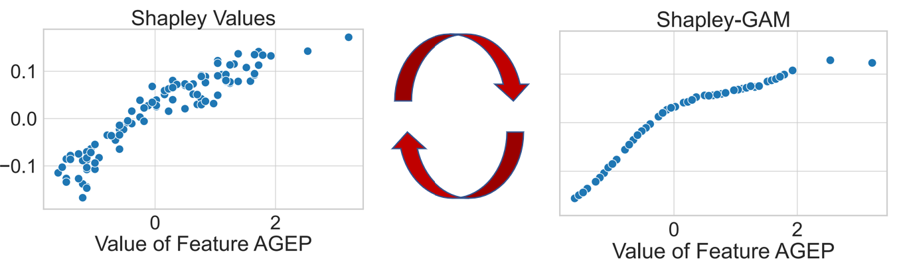
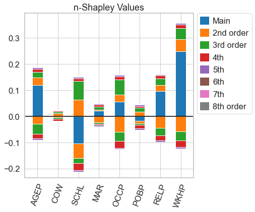
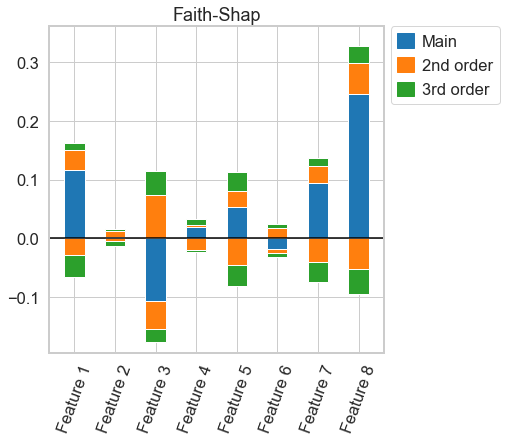
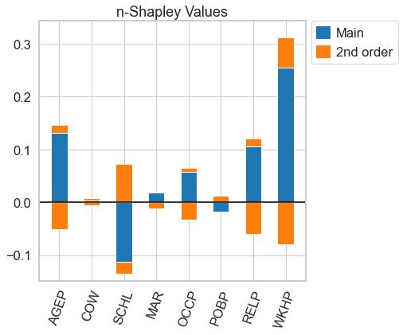
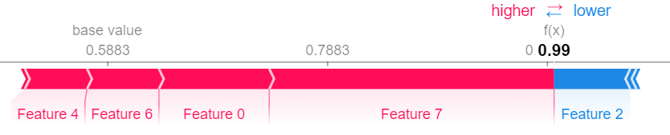

# Welcome to the nshap Package!


<p align="center">
  
</p>

This is a python package to compute interaction indices that extend the Shapley Value. It accompanies the AISTATS'23 paper [From Shapley Values to Generalized Additive Models and back](http://arxiv.org/abs/2209.04012) by Sebastian Bordt and Ulrike von Luxburg.

[](https://pypi.org/project/nshap/)
[](https://tml-tuebingen.github.io/nshap/)

[](https://opensource.org/licenses/MIT)

This package supports, among others, 

- [n-Shapley Values](http://arxiv.org/abs/2209.04012), introduced in our paper
- [SHAP Interaction Values](https://www.nature.com/articles/s42256-019-0138-9), a popular interaction index that can also be computed with the [shap](https://github.com/slundberg/shap/) package
- the [Shapley Taylor](https://arxiv.org/abs/1902.05622) interaction index
- the [Faith-Shap](https://arxiv.org/abs/2203.00870) interaction index
- the [Faith-Banzhaf](https://arxiv.org/abs/2203.00870) interaction index.

The package  works with arbitrary user-defined value functions. It also provides a model-agnostic implementation of the interventional SHAP value function. 

Note that the computed interaction indices are an estimate [that can be inaccurate](#estimation), especially if the order of the interaction is large.

Documentation is available at [https://tml-tuebingen.github.io/nshap](https://tml-tuebingen.github.io/nshap/).

⚠️ Disclaimer 

This package does not provide an efficient way to compute Shapley Values. For this you should refer to the [shap](https://github.com/slundberg/shap/) package or approaches like [FastSHAP](https://arxiv.org/abs/2107.07436). In practice, the current implementation works for arbitrary functions of up to ~10 variables.

## Setup

To install the package run

```
pip install nshap
```

## Computing Interaction Indices

Let's assume that we have trained a Gradient Boosted Tree on the [Folktables](https://github.com/zykls/folktables) Income data set.

```python
gbtree = xgboost.XGBClassifier()
gbtree.fit(X_train, Y_train)
print(f'Accuracy: {accuracy_score(Y_test, gbtree.predict(X_test)):0.3f}')
```
```Accuracy: 0.830```

Now we want to compute an interaction index. This package supports interaction indices that extend the Shapley Value. This means that the interaction index is based on a value function, just as the Shapley Value. So we need to define a value function. We can use the function ```nshap.vfunc.interventional_shap```, which approximates the interventional SHAP value function.

```python
import nshap

vfunc = nshap.vfunc.interventional_shap(gbtree.predict_proba, X_train, target=0, num_samples=1000)
```
The function takes 4 arguments

- The function that we want to explain
- The training data or another sample from the data distribution
- The target class (required here since 'predict_proba' has 2 outputs).
- The number of samples that should be used to estimate the expectation (Default: 1000)

Equipped with a value function, we can compute different kinds of interaction indices. We can compute n-Shapley Values

```python
n_shapley_values = nshap.n_shapley_values(X_test[0, :], vfunc, n=8)
```

the Shapley-Taylor interaction index

```python
shapley_taylor = nshap.shapley_taylor(X_test[0, :], vfunc, n=8)
```

or the Faith-Shap interaction index of order 3

```python
faith_shap = nshap.faith_shap(X_test[0, :], vfunc, n=3)
```

The functions that compute interaction indices have a common interface. They take 3 arguments

- ```x```: The data point for which to compute the explanation ([numpy.ndarray](https://numpy.org/doc/stable/reference/generated/numpy.ndarray.html))

- ```v_func```: The value function.

- ```n```: The order of the interaction index.  Defaults to the number of features.

All functions return an object of type ```InteractionIndex```. To get the interaction between features 2 and 3, simply call

```python
n_shapley_values[(2,3)]
```

``` 0.0074```

To visualize an interaction index, call

```python
n_shapley_values.plot(feature_names = feature_names)
```

<p align="left">
  
</p>

This works for all interaction indices

```python
faith_shap.plot(feature_names = feature_names)
```

<p align="left">
  
</p>

For n-Shapley Values, we can compute interaction indices of lower order from those of higher order

```python
n_shapley_values.k_shapley_values(2).plot(feature_names = feature_names)
```

<p align="left">
  
</p>

We can also obtain the original Shapley Values and plot them with the plotting functions from the [shap](https://github.com/slundberg/shap/) package.

```python
import shap

shap.force_plot(vfunc(X_test[0,:], []), n_shapley_values.shapley_values())
```

<p align="left">
  
</p>

Let us compare our result to the Shapley Values obtained from the KernelSHAP Algorithm.

```python
explainer = shap.KernelExplainer(gbtree.predict_proba, shap.kmeans(X_train, 25))
shap.force_plot(explainer.expected_value[0], shap_values[0])
```

<p align="left">
  
</p>

## The ```InteractionIndex``` class

The ```InteractionIndex``` class is a python ```dict``` with some added functionallity. It supports the following operations. 

-  The individual attributions can be indexed with tuples of integers. For example, indexing with ```(0,)``` returns the main effect of the first feature. Indexing with ```(0,1,2)``` returns the interaction effect between features 0, 1 and 2.

- ```plot()``` generates the plots described in the paper.

- ```sum()``` sums the individual attributions (this does usually sum to the function value minus the value of the empty coalition)

- ```save(fname)``` serializes the object to json. Can be loaded from there with ```nshap.load(fname)```. This can be useful since computing interaction indices takes time, so you might want to compute them in parallel, then aggregate the results for analysis.

Some function can only be called certain interaction indices:

- ```k_shapley_values(k)``` computes the $k$-Shapley Values using the recursive relationship among $n$-Shapley Values of different order (requires $k\leq n$). Can only be called for $n$-Shapley Values.

- ```shapley_values()``` returns the associated original Shapley Values as a list. Useful for compatiblity with the [shap](https://github.com/slundberg/shap/) package.

## Definig Value Functions

A value function has to follow the interface ```v_func(x, S)``` where ```x``` is a single data point (a [numpy.ndarray](https://numpy.org/doc/stable/reference/generated/numpy.ndarray.html)) and ```S``` is a python ```list``` with the indices the the coordinates that belong to the coaltion.

In the introductory example with the Gradient Boosted Tree,

```python
vfunc(x, [])
```

returns the expected predicted probability that an observation belongs to class 0, and

```python
vfunc(x, [0,1,2,3,4,5,6,7])
```

returns the predicted probability that the observation ```x``` belongs to class 0 (note that the problem is 8-dimensional).

## Implementation Details

At the moment all functions computes interaction indices simply via their definition. Independent of the order ```n``` of the $n$-Shapley Values, this requires to call the value function ```v_func``` once for all $2^d$ subsets of coordinates. Thus, the current implementation provides no essential speedup for the computation of $n$-Shapley Values of lower order.

The function ```nshap.vfunc.interventional_shap``` approximates the interventional SHAP value function by intervening on the coordinates of randomly sampled points from the data distributions.

## <a name="estimation"></a> Accuray of the computed interaction indices

The computed interaction indices are an estimate which can be inaccurate.

The estimation error depends on the precision of the value function. With the provided implementation of the interventional SHAP value function, the precision depends on the number of samples used to estimate the expectation.

A simple way to test whether your result is precisely estimated to increase the number of samples (the ```num_samples``` parameter of ```nshap.vfunc.interventional_shap```) and see if the result changes.

For more details, check out the discussion in [Section 8 of our paper](http://arxiv.org/abs/2209.04012).

## Replicating the Results in our Paper

The folder ```notebooks\replicate-paper``` contains Jupyter Notebooks that allow to replicated the results in our [paper](http://arxiv.org/abs/2209.04012).

- The notebooks ```figures.ipynb``` and  ```checkerboard-figures.ipynb``` generate all the figures in the paper.
- The notebook ```estimation.ipynb ``` provides the estimation example with the kNN classifier on the Folktables Travel data set that we discuss in Appendix Section B.
- The notebook ```hyperparameters.ipynb``` cross-validates the parameter $k$ of the kNN classifier.
- The notebooks ```compute.ipynb```,  ```compute-vfunc.ipynb```, ```checkerboard-compute.ipynb``` and ```checkerboard-compute-million.ipynb``` compute the different $n$-Shapley Values. You do not have to run these notebooks, the pre-computed results can be downloaded [here](https://nextcloud.tuebingen.mpg.de/index.php/s/SsowoR7SAibQYE7).

⚠️ Important

You have use version 0.1.0 of this package in order to run the notebooks that replicate the results in the paper.

```
pip install nshap=0.1.0
```

## Citing nshap

If you use this software in your research, we encourage you to cite our paper.

```bib
@inproceedings{bordtlux2023,
  author    = {Bordt, Sebastian and von Luxburg, Ulrike},
  title     = {From Shapley Values to Generalized Additive Models and back},
  booktitle = {AISTATS},
  year      = {2023}
 }
```

If you use interaction indices that were introduced in other works, such as [Shapley Taylor](https://arxiv.org/abs/1902.05622) or [Faith-Shap](https://arxiv.org/abs/2203.00870), you should also consider to cite the respective papers.

