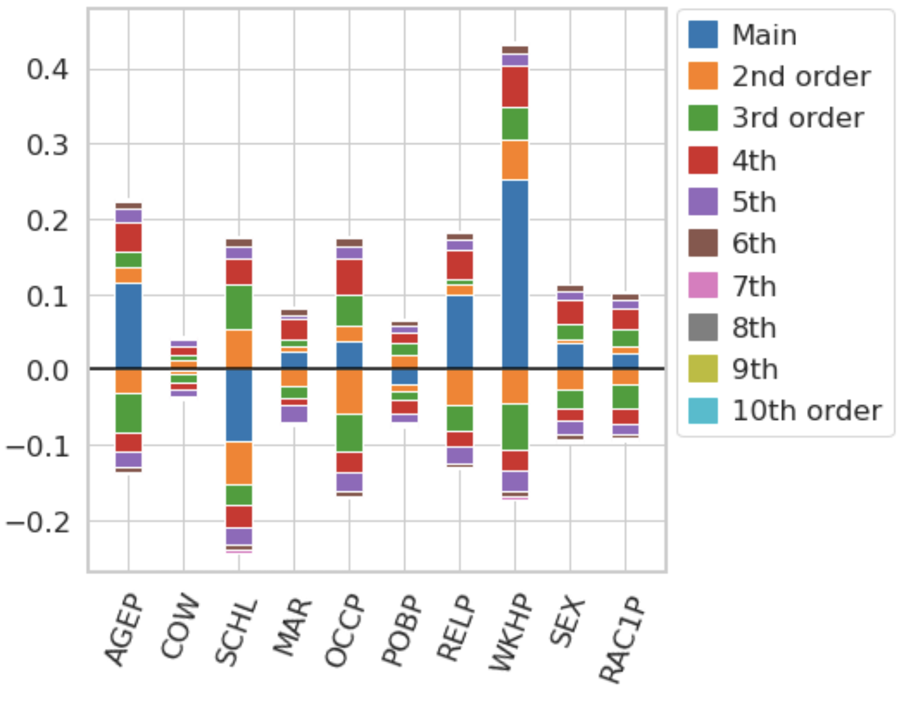
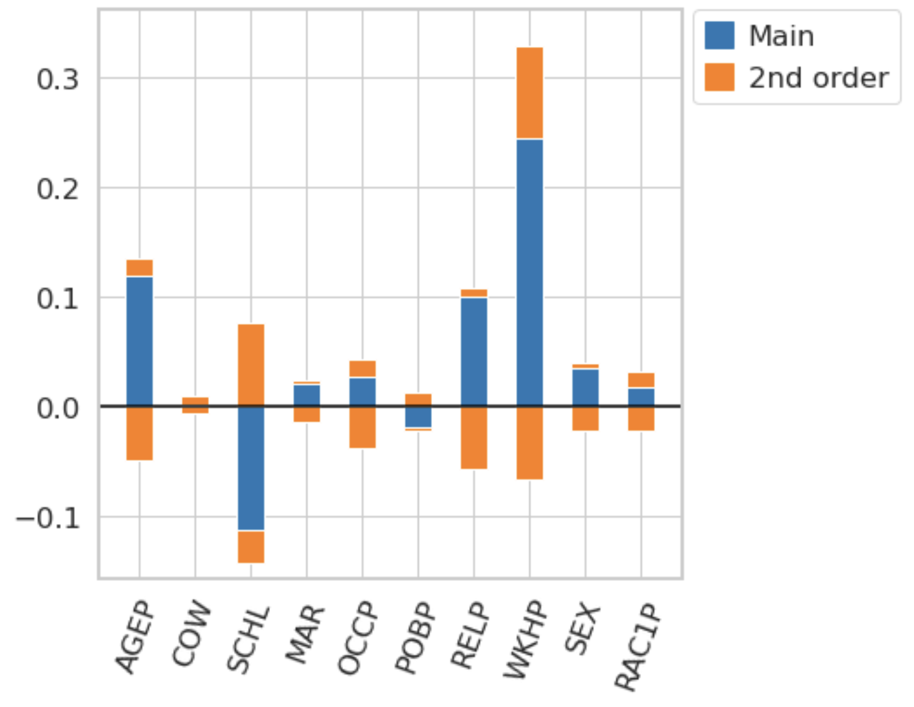
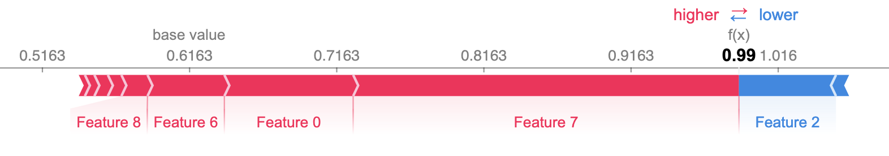
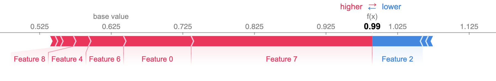

A Simple Example
----------------
Let's assume that we have trained a Gradient Boosted Tree on the https://github.com/zykls/folktables Income data set.

.. code:: python

  gbtree = xgboost.XGBClassifier()
  gbtree.fit(X_train, Y_train)
  print(f'Accuracy: {accuracy_score(Y_test, gbtree.predict(X_test)):0.3f}')

:code:`Accuracy: 0.829`

In order to compute n-Shapley Values, we need to define a value function. The function :code:`nshap.vfunc.interventional_shap` approximates the interventional SHAP value function.

.. code:: python

  import nshap
  vfunc = nshap.vfunc.interventional_shap(gbtree.predict_proba, 
                                          X_train, 
                                          target=0, 
                                          num_samples=1000)

The function takes 4 arguments

- The function that we want to explain
- The training data or another sample from the data distribution
- The target class (required here since 'predict_proba' has 2 outputs).
- The number of samples that should be used to estimate the conditional expectation (Default: 1000)

Equipped with a value function, we can compute n-Shapley Values.

.. code:: python

  n_shapley_values = nshap.n_shapley_values(X_test[0, :], vfunc, n=10)

The function returns an object of type :code:`nShapleyValues`. It is a python :code:`dict` with some added functionallity. 

To get the interaction effect between features 2 and 3, simply call

.. code:: python

  n_shapley_values[(2,3)]

:code:`0.0074`

To generate the plots in the paper, call

.. code:: python

  n_shapley_values.plot(feature_names = feature_names)

and to compute 2-Shapley Values and generate a plot, use

.. code:: python

  n_shapley_values.k_shapley_values(2).plot(feature_names = feature_names)

We can also compare these results with the Shapley Values returned by the https://github.com/slundberg/shap/ package.

For this, we approximate the Shapley Values with Kernel SHAP

.. code:: python

  import shap

  explainer = shap.KernelExplainer(gbtree.predict_proba, shap.kmeans(X_train, 25))
  shap.force_plot(explainer.expected_value[0], shap_values[0])

and then generate the same plot for the Shapley Values that we just computed with the `nshap` package.

.. code:: python

  shap.force_plot(vfunc(X_test[0,:], []), n_shapley_values.shapley_values())

There are slight differences which is not surprising since we used two very different methods to compute the Shapley Values.